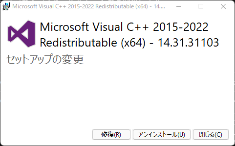
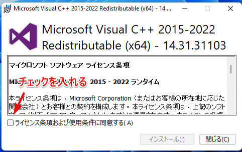
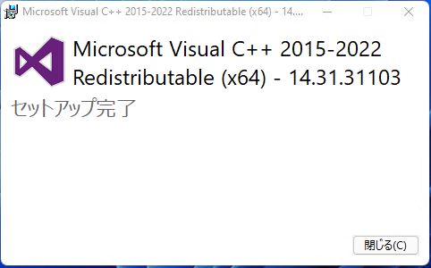
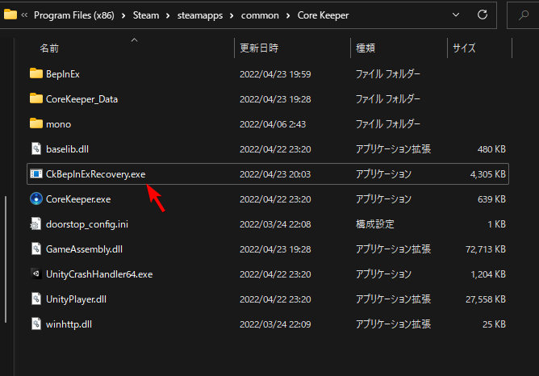
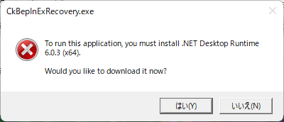
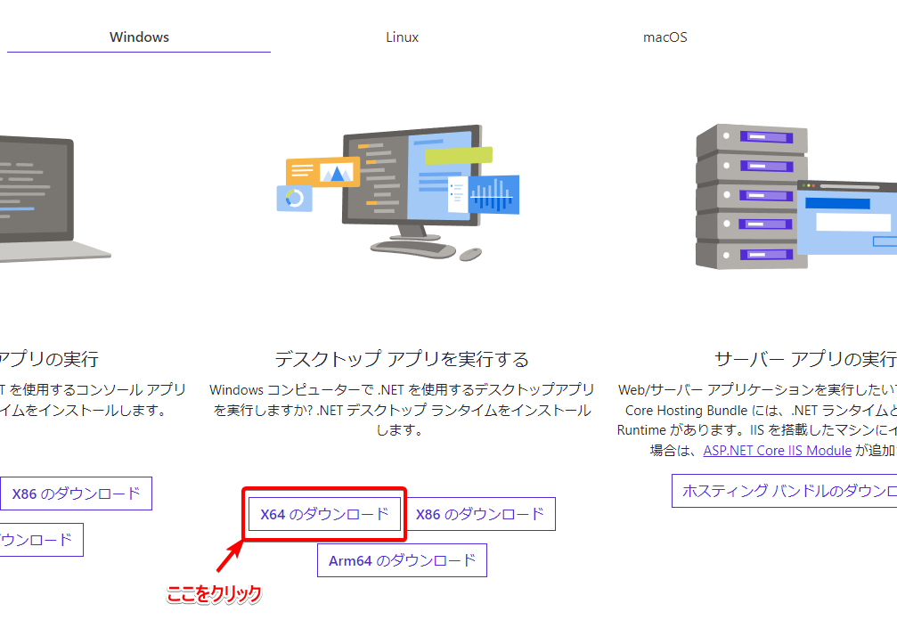
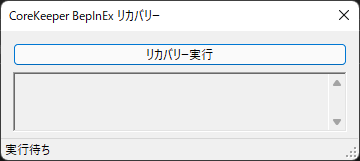
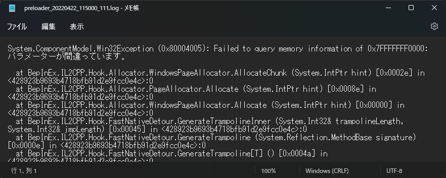
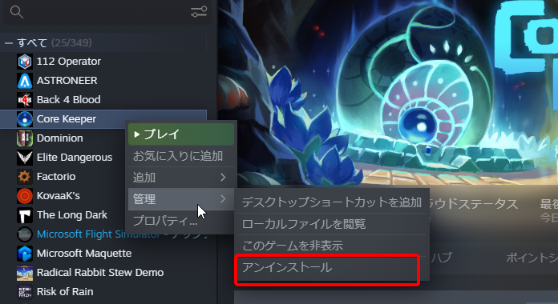

# Core Keeper 日本語化MOD

# リリース 

[リリース](../../releases) から最新バージョンのMODをダウンロード可能です  
2種類用意しています。
* ckjp-all.zip
  - MODローダ(BepInEx IL2CPP)を含めた、初回導入向けの圧縮ファイルです。導入方法は、 [初回利用者向け](#初回利用者向け) をご覧ください
* ckjp.dll
  - MODローダを既に導入している、または既に当日本語化MODを利用しており、アップデートする際におすすめです。 `BepInEx` フォルダ内の `plugins` フォルダに設置してください。上記 `ckjp-all.zip` を使用した場合は不要です。

# 機能
* Core Keeperを日本語化するMODです。フォントの適用、日本語化の適用が全てこのMODだけで可能です
* 日本語化は起動時に毎回翻訳用のシートからダウンロードしているため、常に最新の翻訳で楽しむことが出来ます

# 翻訳について
[スプレッドシート](https://docs.google.com/spreadsheets/d/1csBM-ZqZtG_z_JdLaFvGHHy8UABZdxRRdT_ShJM5zTE/edit#gid=0) によって翻訳作業を行っています  
翻訳作業の手伝いはとても歓迎ですが、もし荒らし等発生した場合は権限を狭める等対策を取る可能性があります

翻訳者向け便利機能: `F8` キーを押すことでゲーム中に最新の翻訳を読み込むことが可能です

# 初回利用者向け
1. Steamからゲームの `ローカルファイルを閲覧` からゲームのインストールフォルダを開きます  

2. フォルダを開くと以下のようになっているはずです  

3.  `ckjp-all.zip` をインストールフォルダ内に解凍します。 **Core Keeperフォルダ内にさらにフォルダを作らないように注意してください。例えば、`Core Keeper` フォルダ内に `ckjp-all` フォルダが作られて、その中に解凍されている場合、正しくありません。以下の画像と同じになるようにしてください**  

4. ゲームを起動します。 **初回起動には１～２分ほど時間がかかります**
5. ゲームが起動し、日本語化されていれば完了です

# 設定
[BepInEx ConfigManager](https://github.com/sinai-dev/BepInExConfigManager) を別途利用することでゲーム内から `F5` キーで設定画面を開くことが出来ます  
Core Keeperインストールフォルダ内の `BepInEx` 内にある `config` フォルダの `ckjp.cfg` ファイルを直接編集することでも可能です
* アイテム名を日本語化しない
  - 検索のためにアイテム名は日本語化したくない方向けのオプションです。デフォルトで無効です。有効( `true` )にすることでアイテム名は英語のままにすることが可能です

# 既知の問題
* フォントが一部アンチエイリアスをかけたような表示になる
  - 解決するには手製のフォントジェネレータを改修する必要があるため、先延ばしにしています。後々修正予定です

# 配信等での使用、その他再頒布等
* どこで使用していただいてもかまいません。
* MITライセンスで配布している通り、著者名を書いていただければ改造、再配布は自由です。軽微な修正などであれば、派生版を作るのでなくプルリクを飛ばしてもらえるととても喜びます。

# トラブルシューティング
MODをインストールしてみたが、ゲームが起動しなくなってしまった方向けに、回復ツールを同梱しています。  
MODインストール時にゲームが起動しない、ゲームアップデート時に起動しないなど、何らかで起動しなくなってしまった際は下記の手順を進めてみてください。

## Microsoft Visual C++ 再頒布可能パッケージ

[こちら](https://aka.ms/vs/17/release/vc_redist.x64.exe) をダウンロードし、実行してください。

> もし起動した時に、下のように、「セットアップの変更」が表示されている場合、この手順は不要です  

起動したら、同意にチェックを入れ、「インストール」をクリックしてください

以下のように表示されれば完了です。もし「再起動する」など表示されたら、指示通り再起動を行ってください。その後、ゲームを起動しても正常に動作しない場合、次の項目に進んでください。

## unhollowedフォルダが生成されない

ゲームフォルダ内の `CkBepInExRecovery.exe` を起動してください

> もし以下のような画面が出た場合、 `はい` をクリックするとブラウザで `.NET 6.0 ランタイムのダウンロード` が開きます。  
>   
> 以下の画像の通り、 `デスクトップアプリを実行する` 項目の `X64のダウンロード` をクリックし、ダウンロード後インストール手順に従って、インストールしてください
>   

以下のような画面が出たら `リカバリー開始` をクリックして、左下が `完了` になるまで待ってから終了してください

この状態でゲームを起動して、正しく起動しない場合、次の項目に進んでください。

## ゲームデータの破損

`Core Keeper` フォルダ内に `preloader_` …から始まるファイルが出現していませんか？  
もし、その中身が以下のように書かれていた場合、ゲームデータが破損している可能性があります。

この場合、Steamからゲームをアンインストールし、再度インストールを行ってください。  
セーブファイルは他の場所に保管されているため、再インストールを行っても影響はありません。

再インストールが完了したら、再度 `CkBepInExRecovery` の実行等、上記トラブルシューティングを再実施してください。

## これでも起動しない場合
もしこれでも起動しない場合、TwitterID @azutake_dev まで問い合わせください。  
出来る限り全力で対応しますので、ぜひともご連絡ください！

# このMODを作成するにあたって使用したリソース
* [BepInEx IL2CPP](https://github.com/BepInEx/BepInEx)
* [PixelMplus](https://itouhiro.hatenablog.com/entry/20130602/font)
