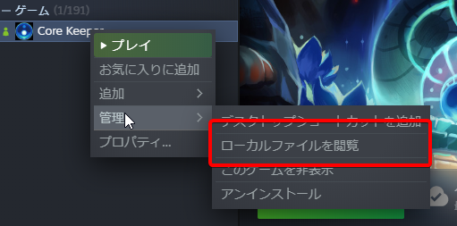
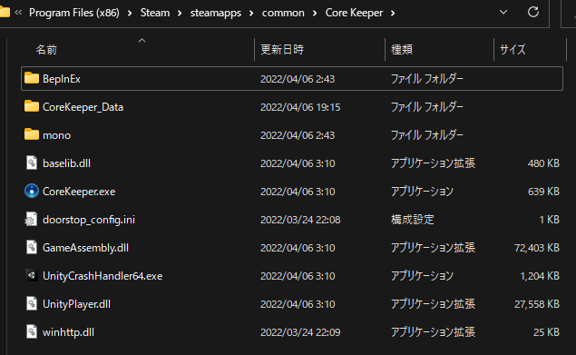

# Core Keeper 日本語化MOD

# リリース 

[リリース](../releases) から最新バージョンのMODをダウンロード可能です  
2種類用意しています。
* ckjp-all.zip
  - MODローダ(BepInEx IL2CPP)を含めた、初回導入向けの圧縮ファイルです。導入方法は、 [初回利用者向け](#初回利用者向け) をご覧ください
* ckjp.dll
  - MODローダを既に導入している、または既に当日本語化MODを利用しており、アップデートする際におすすめです。 `BepInEx` フォルダ内の `plugins` フォルダに設置してください。上記 `ckjp-all.zip` を使用した場合は不要です。

# 機能
* Core Keeperを日本語化するMODです。フォントの適用、日本語化の適用が全てこのMODだけで可能です
* 日本語化は起動時に毎回翻訳用のシートからダウンロードしているため、常に最新の翻訳で楽しむことが出来ます

# 翻訳について
[スプレッドシート](https://docs.google.com/spreadsheets/d/1csBM-ZqZtG_z_JdLaFvGHHy8UABZdxRRdT_ShJM5zTE/edit#gid=0) によって翻訳作業を行っています  
翻訳作業の手伝いはとても歓迎ですが、もし荒らし等発生した場合は権限を狭める等対策を取る可能性があります

# 初回利用者向け
1. Steamからゲームの `ローカルファイルを閲覧` からゲームのインストールフォルダを開きます  

2. フォルダを開くと以下のようになっているはずです  

3.  `ckjp-all.zip` をインストールフォルダ内に解凍します。 **Core Keeperフォルダ内にさらにフォルダを作らないように注意してください。例えば、`Core Keeper` フォルダ内に `ckjp-all` フォルダが作られて、その中に解凍されている場合、正しくありません。以下の画像と同じになるようにしてください**  

4. ゲームを起動します。 **初回起動には１～２分ほど時間がかかります**
5. ゲームが起動し、日本語化されていれば完了です

# 設定
[BepInEx ConfigManager](https://github.com/sinai-dev/BepInExConfigManager) を別途利用することでゲーム内から `F5` キーで設定画面を開くことが出来ます  
Core Keeperインストールフォルダ内の `BepInEx` 内にある `config` フォルダの `ckjp.cfg` ファイルを直接編集することでも可能です
* 言語を強制的に日本語にする
  - 技術的問題により、言語設定を日本語にしてもゲーム開始時に英語になってしまうため、起動時日本語に切り替えるオプションです。デフォルトで有効になっています。他の言語で遊びたい場合、オフにすることを推奨します
* パッチ適用までのフレーム数
  - CoreKeeperの言語リソース読み込みが非同期であるため、マシンスペックによってはパッチ適用と言語リソース読み込みが競合し、ゲーム中に不具合が生じる可能性があるため、フレーム数を調整出来るようになっています。ゲーム中に問題が生じた場合、この数値を大きくしてみてください

# 既知の問題
* フォントが一部アンチエイリアスをかけたような表示になる
  - 解決するには手製のフォントジェネレータを改修する必要があるため、先延ばしにしています。後々修正予定です
* `F8` キーで翻訳再読み込みをするとゲームの挙動がおかしくなる時がある
  - 原因不明のため修正の目途なし。原因が分かったら修正するかもしれません

# このMODを作成するにあたって使用したリソース
* [BepInEx IL2CPP](https://github.com/BepInEx/BepInEx)
* [PixelMplus](https://itouhiro.hatenablog.com/entry/20130602/font)